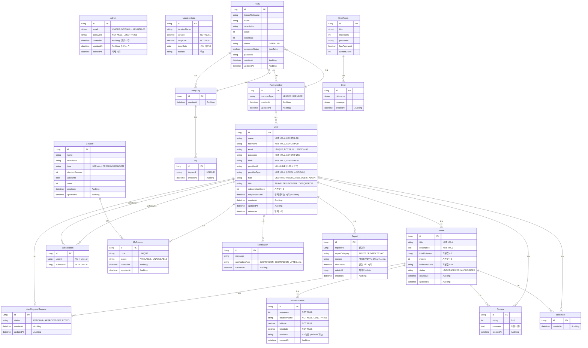

<div align="center">
수정중
    
# 여행 정복 - 여정 
<br>

### "여행 정복"은<br> 회원들이 경로(Route)를 작성하고 공유하며,<br> 다른 회원은 해당 경로를 즐겨찾기(Bookmark), 리뷰(Review), 채팅, 파티모집 등의<br> 기능을 통해 소통할 수 있는 서비스입니다.<br>

----------------------------------------------------
목차 (Table of Contents) - 하이퍼링크? 해당위치로<br>

 1.프로젝트 개요<br>
 2.주요 기능<br>
 3.사용 기술<br>
 4.프로젝트 구조<br>
 5.설치 및 실행 방법<br>
 6.와이어 프레임<br>
 7.API 문서<br>
 8.ERD<br>
 9.기타 참고 ? 시연영상 ?<br>
10.추 후 개선 방향<br>

---------------------------------------------------
## 1. 프로젝트 개요 <br>
### 프로젝트 기간
24.12.02 ~ 25.01.07
### 프로젝트 목표

유저들이 자신의 여행 경로를 직접 생성/공유하고, 다른 유저는 해당 경로를 즐겨찾기, 리뷰로 피드백하며,<br>
앱 내부의 여러 기능(쿠폰, 채팅, 파티, 구독 등)을 통해 커뮤니티를 형성하게 하는 것이 목표입니다.<br>

### 팀 소개
| 이름<br>(GitHub) | 역할 |담당 기능|
|-----|-----|-----|
|<div align="center">[조성준](https://github.com/matino0216](https://github.com/seongjun1130))|Leader| 담당 </div> |
|<div align="center">[김명훈](https://github.com/LEEJI-HOON1](https://github.com/anewsdev))|SubLeader| 담당 </div> |
|<div align="center">[신진오](https://github.com/lastdove](https://github.com/lastdove))|Member| 담당 </div> |
|<div align="center">[윤영한](https://github.com/seongjun1130](https://github.com/0han7))|Member| 담당 </div> |
|<div align="center">[홍주영](https://github.com/92jy38)|Member| 담당 </div> |

--------------------------------------------------
## 2. 주요 기능
#### - 여행 경로
    - 사용자는 자신만의 여행 루트를 생성하고, 각 경유지에 대한 정보 (이름, 좌표, 사진/영상)를 추가할 수 있습니다.
    - 다른 사용자가 생성한 루트를 조회하고, 키워드(제목, 내용, 작성자, 장소)로 검색할 수 있습니다.
    - 인기 루트 순위(월 별, 이번 달 실시간, 역대 TOP 100)를 제공합니다.
    - 각 여행 경로에 대한 상세 정보(경유지 목록, 리뷰, 동선)를 제공합니다.
    - 관리자는 일반 사용자가 생성한 경로를 심사하고 승인/거절 할 수 있습니다.
#### - 사용자
    - 이메일/비밀번호를 사용한 자체 회원가입 및 로그인 기능을 제공합니다.
    - Kakao, Google 소셜 로그인을 지원합니다.
    - 사용자는 다른 사용자를 구독하고, 자신의 팔로잉/팔로워 목록을 조회할 수 있습니다.
    - 사용자는 여행 경로에 대한 즐겨찾기 추가/삭제 및 리뷰 작성/삭제가 가능합니다.
    - 관리자는 사용자 계정을 정지/해제하거나 삭제할 수 있습니다.
    - 특정 조건을 만족하는 사용자에게 칭호를 부여합니다.
#### - 관리자
    - 관리자는 일반 사용자가 생성한 등업 신청을 승인/거절할 수 있습니다.
    - 사용자, 게시글, 댓글 등에 대한 신고를 접수하고 처리(승인/거절)할 수 있습니다.
    - 쿠폰을 생성하고 관리할 수 있습니다.
#### - 쿠폰
    - 사용자는 관리자가 생성한 쿠폰을 발급 받을 수 있습니다.
    - 발급 된 쿠폰은 만료일에 맞춰 자동 삭제됩니다.
    - 쿠폰은 정복자 등급만 등록할 수 있는 프리미엄 쿠폰과 일반 쿠폰으로 나뉩니다.
#### - 채팅
    - 사용자들은 실시간으로 채팅방을 생성하고 참여하여 소통할 수 있습니다.
    - 채팅방은 제목, 최대 사용자 수, 비밀번호 설정이 가능합니다.
#### - 알림
    - 사용자에게 실시간 알림을 제공합니다.
#### - 파티

-----------------------------------------------------
## 3. 사용 기술 및 개발 환경 -> 기술스택


### 🖥 language & Server 🖥

</a>
 <br>

 <br>
</a> <br>
</a>
+ Java

Spring Boot
Spring Data JPA
Spring Data JDBC
Spring Security + JWT
Spring Validation
OAuth2
QueryDSL
Spring Batch
Docker
Intellij IDEA
Git / GitHub
Notion / Slack / ZEP
AWS ECS Fargate
AWS S3
Jmeter
Prometheus / Grafana
GitHub Actions
Nginx

### 👏 Tools etc. 👏
 <br> 
</a></a>


Language/Framework: Java 17, JDK 17, Spring Boot
Build Tool: Gradle
Database: MySQL 8.0
+++로깅 모니터링
Persistence: JPA, QueryDSL
Security: Spring Security (JWT)
REST Client: Spring Cloud OpenFeign
Cache: Redis, Spring Cache(Cachable)
Local Storage SAVE
CI/CD
배포: AWS EC2 , Docker ???
Deployment: AWS EC2, AWS S3(미디어 업로드)
External Services
카카오 지도 API: 경로 안내
AWS S3: 파일 업로드
OAuth2: Kakao, Google OAuth


Language	Java	주 사용 언어 
DB	MY SQL	Main DB
DB	REDIS	캐싱 DB
BackEnd	Spring Boot	애플리케이션 프레임워크
BackEnd	Spring Data JPA	ORM 기반 데이터 엑세스 계층 구현
BackEnd	Spring Data JDBC	Bulk Update
BackEnd	Spring Security + JWT	인증 및 인가 관리
BackEnd	Spring Validation	유효성 검증
BackEnd	OAuth2	소셜 로그인 (카카오, 구글)
BackEnd	QueryDSL	동적 쿼리 생성
BackEnd	Spring Batch	배치 라이브러리
BackEnd	Docker	서버별 서비스구축 도구
Tools	Intellij IDEA	백엔드 개발 환경 / JDK 17
Tools	Git / GitHub	버전 관리 및 협업 도구
Tools	Notion / Slack / ZEP	협업 도구
InfraStructure	AWS ECS Fargate	클라우드 서비스
InfraStructure	AWS S3	파일 및 이미지 저장소
InfraStructure	Jmeter	성능 및 부하 테스트
InfraStructure	Prometheus / Grafana	애플리케이션 모니터링
InfraStructure	GitHub Actions	CI / CD 자동화 관리
InfraStructure	Nginx	웹서버

<HR>
</div>

## 4. 프로젝트 구조
  - 아키텍처

<br>

  - 패키지 구조
```plaintext
com.sparta.travelconquestbe
├── TravelConquestBeApplication.java

├── api
│   ├── admin
│   ├── auth
│   ├── bookmark
│   ├── chat
│   ├── client
│   ├── coupon
│   ├── mycoupon
│   ├── notification
│   ├── party
│   ├── review
│   ├── route
│   ├── routelocation
│   ├── subscription
│   └── user

├── common
│   ├── annotation
│   ├── aspect
│   ├── auth
│   ├── batch
│   │   ├── itemprocessor
│   │   ├── itemreader
│   │   ├── itemwriter
│   │   ├── Policy
│   │   └── util
│   ├── config
│   │   ├── filter
│   │   └── jwt
│   ├── entity
│   ├── exception
│   ├── handler
│   └── resolver

├── config
│   ├── AppConfig
│   ├── CacheConfig
│   ├── QueryDslConfig
│   ├── S3Config
│   ├── SecurityConfig
│   ├── WebConfig
│   ├── WebMvcConfig
│   └── WebSocketConfig

├── domain
│   ├── admin
│   ├── bookmark
│   ├── chat
│   ├── coupon
│   ├── locationdata
│   ├── mycoupon
│   ├── notification
│   ├── party
│   ├── partyMember
│   ├── tag
│   ├── report
│   ├── review
│   ├── route
│   ├── routelocation
│   ├── subscription
│   ├── user
│   └── PartyTag

└── resources
    ├── application.yml
    └── ...
```
----------------------------------------------
<div align="center">
    
## 5. 설치 및 실행 방법???
프로젝트 클론
- git clone
https://github.com/onejo-matjib/travel-conquest-be.git
환경 변수 설정 ?????
application.properties 혹은 application.yml 등에 MySQL, AWS, Kakao 등에 대한 키를 설정해야 합니다.
properties
spring.datasource.url=jdbc:mysql://localhost:3306/travel-conquest
spring.datasource.username=admin
spring.datasource.password=admin
JWT_SECRET_KEY=
KAKAO_CLIENT_ID=
추가++
AWS_ACCESS_KEY=
AWS_SECRET_KEY=
버킷
브라우저에서 http://localhost:8080 접근 후, 정상 동작 확인 +++

-----------------------------------------------------------
## 6. 와이어 프레임
이미지 + 링크?

------------------------------------------------------
## 7. API 문서
postman publishing

--------------------------------------------------

## 8. ERD


--------------------
## 9. 기타+++
노션 링크???

---------------------
## 10. 추후 개선 방향


</div>
