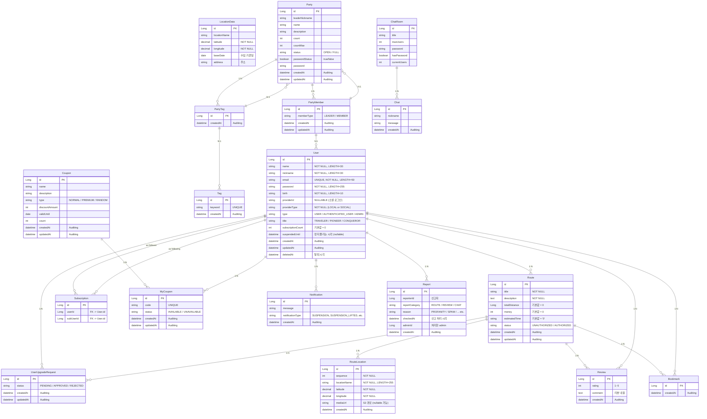

<div align="center">

# 여행 정복 - 여정 
<br>

### ⭐여행 정복⭐<br> 회원들이 경로를 작성하고 공유하며,<br> 다른 회원은 해당 경로를 즐겨찾기, 리뷰, 채팅, 파티모집 등의<br> 기능을 통해 소통할 수 있는 서비스입니다.<br>

----------------------------------------------------
### 목차 (Table of Contents)<br>

 [1. 프로젝트 개요](#1-프로젝트-개요-) <br>
 [2. 주요 기능](#2-주요-기능) <br>
 [3. 사용 기술](#3-사용-기술-및-개발-환경) <br>
 [4. 프로젝트 구조](#4-프로젝트-구조) <br>
 [5. 서비스 아키텍쳐](#5-서비스-아키텍쳐) <br>
 [6. API 문서](#6-api-문서) <br>
 [7. ERD](#7-erd) <br>
 [8. 시연 영상](#8-시연-영상) <br>
 [9. 추후 개선 방향](#9-추후-개선-방향) <br>
 [10. 기타 참고 문서](#10-기타-참고-문서) <br>

---------------------------------------------------

## 1. 프로젝트 개요 <br>
### 프로젝트 기간
24.12.02 ~ 25.01.07<br>
### 프로젝트 목표

유저들이 자신의 여행 경로를 직접 생성/공유하고, 다른 유저는 해당 경로를 즐겨찾기, 리뷰로 피드백하며,<br>
앱 내부의 여러 기능(쿠폰, 채팅, 파티, 구독 등)을 통해 커뮤니티를 형성하게 하는 것이 목표입니다.<br>

### 팀 소개

</div>

--------------------------------------------------
## 2. 주요 기능


### 여행 경로
 - 사용자는 자신만의 여행 루트를 생성하고, 각 경유지에 대한 정보 (이름, 좌표, 사진/영상)를 추가할 수 있습니다.
 - 다른 사용자가 생성한 루트를 조회하고, 키워드(제목, 내용, 작성자, 장소)로 검색할 수 있습니다.
 - 인기 루트 순위(월 별, 이번 달 실시간, 역대 TOP 100)를 제공합니다.
 - 각 여행 경로에 대한 상세 정보(경유지 목록, 리뷰, 동선)를 제공합니다.
 - 관리자는 일반 사용자가 생성한 경로를 심사하고 승인/거절 할 수 있습니다.
### 사용자
 - 이메일/비밀번호를 사용한 자체 회원가입 및 로그인 기능을 제공합니다.
 - Kakao, Google 소셜 로그인을 지원합니다.
 - 사용자는 다른 사용자를 구독하고, 자신의 팔로잉/팔로워 목록을 조회할 수 있습니다.
 - 사용자는 여행 경로에 대한 즐겨찾기 추가/삭제 및 리뷰 작성/삭제가 가능합니다.
 - 관리자는 사용자 계정을 정지/해제하거나 삭제할 수 있습니다.
 - 특정 조건을 만족하는 사용자에게 칭호를 부여합니다.
### 관리자
 - 관리자는 일반 사용자가 생성한 등업 신청을 승인/거절할 수 있습니다.
 - 사용자, 게시글, 댓글 등에 대한 신고를 접수하고 처리(승인/거절)할 수 있습니다.
 - 쿠폰을 생성하고 관리할 수 있습니다.
### 쿠폰
 - 사용자는 관리자가 생성한 쿠폰을 발급 받을 수 있습니다.
 - 발급 된 쿠폰은 만료일에 맞춰 자동 삭제됩니다.
 - 쿠폰은 정복자 등급만 등록할 수 있는 프리미엄 쿠폰과 일반 쿠폰으로 나뉩니다.
### 채팅
 - 사용자들은 실시간으로 채팅방을 생성하고 참여하여 소통할 수 있습니다.
 - 채팅방은 제목, 최대 사용자 수, 비밀번호 설정이 가능합니다.
### 알림
 - 사용자에게 실시간 알림을 제공합니다.
### 파티
 - 사용자는 파티를 구성하여 사람들을 모집하여 여행을 계획할 수 있습니다.
-----------------------------------------------------

<div align="center">

## 3. 사용 기술 및 개발 환경


### 🖥 language & Server 🖥

</a> <br>
<br>
 <br>
</a></a> <br>
 <br>
 <br>
<br>
 <br>

### ⚒ Tools etc. 👏
<br>
 <br> 
</a></a>


<HR>
</div>

## 4. 프로젝트 구조

- 아키텍처

<br>
    
- 패키지 구조
```plaintext
com.sparta.travelconquestbe
├── TravelConquestBeApplication.java

├── api
│   ├── admin
│   ├── auth
│   ├── bookmark
│   ├── chat
│   ├── client
│   ├── coupon
│   ├── mycoupon
│   ├── notification
│   ├── party
│   ├── review
│   ├── route
│   ├── routelocation
│   ├── subscription
│   └── user

├── common
│   ├── annotation
│   ├── aspect
│   ├── auth
│   ├── batch
│   │   ├── itemprocessor
│   │   ├── itemreader
│   │   ├── itemwriter
│   │   ├── Policy
│   │   └── util
│   ├── config
│   │   ├── filter
│   │   └── jwt
│   ├── entity
│   ├── exception
│   ├── handler
│   └── resolver

├── config
│   ├── AdminInitializer
│   ├── AppConfig
│   ├── BatchConfig
│   ├── CacheConfig
│   ├── QueryDslConfig
│   ├── S3Config
│   ├── SecurityConfig
│   ├── SuspensionScheduler
│   ├── WebConfig
│   ├── WebMvcConfig
│   └── WebSocketConfig

├── domain
│   ├── admin
│   ├── bookmark
│   ├── chat
│   ├── coupon
│   ├── locationdata
│   ├── mycoupon
│   ├── notification
│   ├── party
│   ├── partymember
│   ├── partytag
│   ├── report
│   ├── review
│   ├── route
│   ├── routelocation
│   ├── subscription
│   ├── tqg
│   └── user

└── resources
    ├── application.yml
    └── ...
```

-----------------------------------------------------------
<div align="center">
 
## 5. 서비스 아키텍쳐


</div>

------------------------------------------------------

## 6. API 문서
기타 모든 API명세는 링크 참조.<br>
<https://www.notion.so/teamsparta/2e66ca7c5175497b9bc2a4b2d49847a3>

#### 회원가입 (Sign Up)
- **URL**: `/api/users/signup`
- **Method**: `POST`
- **Request Body**:
  ```json
  {
    "email": "test@test.com",
    "password": "test1234",
    "nickname": "Traveler123",
    "name": "테스터",
    "birth": "1990-01-01"
  }
  ```
- **Response** 
  ```json
  {
    "userId": 1,
    "email": "test@test.com",
    "nickname": "Traveler123",
    "createdAt": "2025-01-01T10:00:00Z"
  }
  ```
- **Description**: 로컬 회원가입 외 소셜로그인(카카오, 구글)도 가능합니다.

#### 로그인 (Login)
- **URL**: `/api/users/login`
- **Method**: `POST`
- **Request Body**:
  ```json
  {
    "email": "test@test.com",
    "password": "test1234"
  }
  ```
- **Response**:
  ```json
  {
    "accessToken": "eyJhbGciOiJIUzI1...",
    "expiresAt": "2025-01-01T12:00:00Z"
  }
  ```
- **Description**: 로그인시 인증이 완료되면 토큰이 발급됩니다.

--------------------------------------------------
<div align="center">

## 7. ERD


--------------------

## 8. 시연 영상

어플리케이션의 모든 기능들에 대한 시연영상 링크 <br>
<https://drive.google.com/drive/folders/1h7YdLhC3sfyOPiYpJ_XMOth1q9TRX2kg?hl=ko><br>

------------------------------

## 9. 추후 개선 방향


---------------------

## 10. 기타 참고 문서
### - 브로셔 -<br>
<https://teamsparta.notion.site/1-024e8869da34462396a658f8ddd6d80f><br>
### - 팀 노션 -<br>
<https://www.notion.so/teamsparta/2e66ca7c5175497b9bc2a4b2d49847a3><br>
### - 프로젝트 결과 보고서(PPT) -<br>
<https://www.canva.com/design/DAGbGAVNVTE/3C3rAd5haN_VM9PmUhsT5g/edit><br>


</div>
